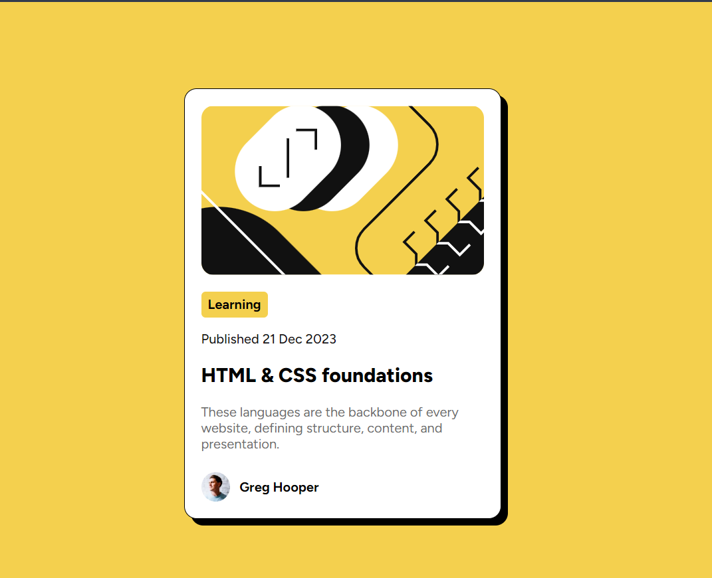

# Frontend Mentor - Blog preview card solution

This is a solution to the [Blog preview card challenge on Frontend Mentor](https://www.frontendmentor.io/challenges/blog-preview-card-ckPaj01IcS). Frontend Mentor challenges help you improve your coding skills by building realistic projects. 

## Table of contents

- [Overview](#overview)
  - [The challenge](#the-challenge)
  - [Screenshot](#screenshot)
  - [Links](#links)
- [My process](#my-process)
  - [Built with](#built-with)
  - [What I learned](#what-i-learned)
  - [Continued development](#continued-development)
  - [Useful resources](#useful-resources)
- [Author](#author)
- [Acknowledgments](#acknowledgments)

**Note: Delete this note and update the table of contents based on what sections you keep.**

## Overview

### The challenge

Users should be able to:

- See hover and focus states for all interactive elements on the page

### Screenshot



### Links

- Solution URL : [Click here!](https://github.com/Jaydev576/Blog-Preview-Card)
- Live Site URL : [Click here!](https://jaydev576.github.io/Blog-Preview-Card/index.html)

## My process

### Built with

- Semantic HTML5 markup
- CSS custom properties
- Flexbox
- Mobile-first workflow

### What I learned

Doing this Blog preview card I learned about using font files in CSS

To see how you can add code snippets, see below:


```css
@font-face {
    font-family: 'Figtree';
    src: url(./assets/fonts/Figtree-VariableFont_wght.ttf) format('truetype');
}
```
### Continued development

Other projects from Frontend Mentor!

### Useful resources

- [w3schools](https://www.w3schools.com) - This helped me learning about using truetype fonts in CSS.

## Author

- Name - Jaydev Parmar
- Frontend Mentor - [@Jaydev576](https://www.frontendmentor.io/profile/jaydev576)
- GitHub - [@Jaydev576](https://github.com/Jaydev576)